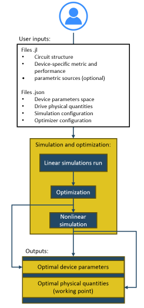
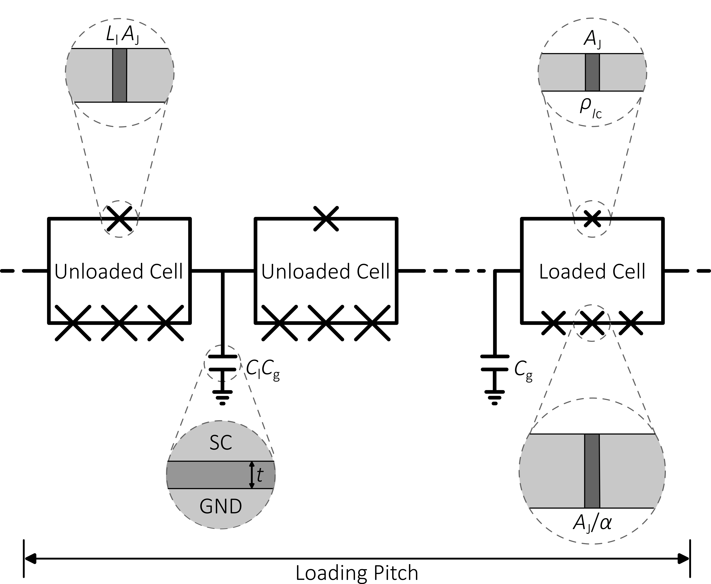

# JosephsonCircuitOptimizer.jl

[JosephsonCircuitOptimizer.jl](https://github.com/SQE-INRiM/JosephsonCircuitsOptimizer) is a Julia package that provides a simulation framework developed using the [JosephsonCircuits.jl](https://github.com/kpobrien/JosephsonCircuits.jl) library [1], which is a powerful tool enables the modeling of superconducting circuits, including Josephson junctions and other nonlinear elements, within a lumped-element approach. It leverages harmonic balance [2], a frequency-domain technique that offers a computationally efficient alternative to traditional time-domain simulations [3].

The [JosephsonCircuitOptimizer.jl](https://github.com/SQE-INRiM/JosephsonCircuitsOptimizer) package explores a vast range of circuit designs by combining different device parameters and applying Bayesian optimization with Gaussian processes [4]. This optimization process is driven by a device-specific metric, guiding the search for optimal circuit parameters to achieve the desired performance.

## **Installation**

To install the package, run the following command in Julia:

```julia
using Pkg
Pkg.add(path="https://github.com/SQE-INRiM/JosephsonCircuitsOptimizer")
```

This will download and install the package directly from GitHub.

Once installed, you can load the package and using it:

```julia
import JosephsonCircuitOptimizer as JCO 
JCO.run()
```


## **How It Works**

To use the [JosephsonCircuitOptimizer.jl](https://github.com/SQE-INRiM/JosephsonCircuitsOptimizer) framework, several inputs must be defined. 
- The **device parameters space** describes the physical parameters that define the circuit's design for fabrication. Each combination of these parameters represents a different circuit in the framework that toghether define a uniform sampling. This space is typically set by fabrication constrains.
- The **physical quantities** define the frequency range and the various signals within the circuit, such as the strong pump tones.
- The **device-specific metric** is a function used to weight every circuit configuration, defined by a set of device parameters. 
- The **targeted performance** is the function that set the optimal working point given by precise physical quantities.

### **Simulation and Optimization Process**
The workflow consists of three main steps:

1. **Linear Simulations:**
   - The first step provides linear simulations, in which selected circuits are analyzed at low pump power.
   - Simulations are conducted for the different circuits of the uniform sampling defined by the different sets of parameters inside the device parameters space.
   - A device-specific metric is computed for each circuit configuration.

2. **Bayesian Optimization:**
   - A Bayesian optimization process, based on Gaussian processes, is performed.
   - The parameters space is iteratively refined to minimize the device-specific metric.
   - At the end of this step, an optimal set of device parameters is determined, defining the circuit structure.

3. **Nonlinear Simulations:**
   - The final step involves nonlinear simulation, in which the circuit is driven at high pump power.
   - This step requires significant computational resources and aims to fine-tune physical quantities to maximize targeted performance (e.g., optimal gain profile).
   - The result is the optimal operating point for the fixed circuit configuration.

<p align="center">
    
</p>

## **Working space structure**

[JosephsonCircuitOptimizer.jl](https://github.com/SQE-INRiM/JosephsonCircuitsOptimizer) operates within an external **working space** containing specific files. These files must be placed inside a folder named `working_space` within the working directory.
The `working_space/user_inputs` folder should contain the following files:
-  `device_parameters_space.json` which contains the device parameters space to define the circuit design. 
-  `drive_physical_quantities.json` in which you define the frequency range and sources features.
-  `optimizer_config.json` with some configuarion of the optimization process.
-  `simulation_config.json` with some configuarion of the simulation process.

-  `user_circuit.jl` in which the circuit schematic is defined with a lumped-element approach.
-  `user_cost_and_performance.jl` with the definition of the device-specific metric and the desired performan functions.
-  `user_parametric_sources.jl` (optional). Some sources can have a parametric input that depends on device parameters. It is possible to create a file which connect the sources with these parameters.

Simulation outputs are saved in `working_space/outputs/output_YYYY-MM-DD_hh-mm-ss`, where the following files are generated:

- `optimal_device_parameters.json` with the optimal set of device parameters that define the circuit structure. 
- `optimal_physical_quantities.json` with the optimal physical quantities (operating point) of the circuit structure.


The structure of the **working space** is the following:
```plaintext
working_space/
├── user_inputs/
│   ├── device_parameters_space.json
│   ├── drive_physical_quantities.json
│   ├── optimizer_config.json
│   ├── simulation_config.json
|   |
│   ├── user_circuit.jl
│   ├── user_cost_and_performance.jl
│   ├── user_parametric_sources.jl 
|
├── outputs/
│   ├── output_YYYY-MM-DD_hh-mm-ss/
│   │   ├── optimal_device_parameters.json
│   │   ├── optimal_physical_quantities.json
```


# **Use case: A SNAIL-based JTWPA**
To test the framework’s capabilities, we focus on optimizing Josephson Traveling-Wave Parametric Amplifiers (JTWPAs), nonlinear superconducting devices that amplify weak quantum signals with near-quantum-limited noise by exploiting parametric gain through Josephson junctions. Specifically, we consider a **Superconducting Nonlinear Asymmetric Inductive eLement (SNAIL)-based JTWPA** [5] operating in the three-wave mixing (3WM) regime [6]. The SNAIL-based design consists of unit cells, each containing a loop with multiple Josephson junctions and characterized by a rich set of device parameters.

The **working space** is presented in the example section. It is composed by

```plaintext
working_space/
├── user_inputs/
│   ├── device_parameters_space.json
│   ├── drive_physical_quantities.json
│   ├── optimizer_config.json
│   ├── simulation_config.json
|   |
│   ├── user_circuit.jl
│   ├── user_cost_and_performance.jl
│   ├── user_parametric_sources.jl 
│   |── user_metric_utils.jl
|   |── flux_curve.txt
```

The schematic of the circuit is implemented in the `user_circuit.jl` file. A scheme of the circuit with the device parameters is presented below.

<p align="center">
    
</p>

The SNAIL-based JTWPA consists of *N* macrocells. Each macrocell is composed of multiple single cells, collectively referred to as the *loading pitch*. Specifically, each macrocell contains*loading pitch*-1 identical cells, known as unloaded cells, and a single distinct cell, called the loaded cell. This structured design enables 3WM through dispersive engineering techniques.
Each individual cell of the SNAIL-based JTWPA consists of two parallel branches. The branches of the loaded cell are
1. The first branch contains a single small Josephson junction (JJ) characterized by a *small junction area* $A_{\text{J}}$ and a *critical current density* $ρ_{\text{Ic}}$, that toghether define the critical current $I_{\text{c}}$ of the junction.
2. The second branch consists of three larger Josephson junctions, whose areas areas are scaled according to the *alpha* $α$ parameter of the SNAIL. Specifically, these JJs have an area of $A_{\text{J}}/α$.

Additionally, the cell is connected to ground through a gate capacitance, which value is given by the *dielectric thickness* $t$ between the capacitor plates.
The distinction between the loaded and unloaded cells is determined by two key parameters: the loading inductance $L_{\text{l}}$ and the loading capacitance $C_{\text{l}}$, which define the inductance ratio (or equivalently the $A_{\text{J}}$ ratio) and capacitance ratio between the loaded and unloaded cells.

These parameters are defined inside specific rangwa given by the fab constraints, including lithography resolution and deposition and growth of thin films (e.g., Al-AlOx). The space formed by these parameters is defined insede the  `device_parameters_space.json`. An example of this file is shown below.

```plaintext
{
    "loadingpitch": [3],
    "nMacrocells": [40],
    "smallJunctionArea": { "start": 1, "step": 1, "stop": 2 },
    "alphaSNAIL": [0.25],
    "LloadingCell": { "start": 1.5, "step": 0.5, "stop": 2 },
    "CgloadingCell": { "start": 1, "step": 0.5, "stop": 1.5 },
    "criticalCurrentDensity": { "start": 0.9, "step": 0.1, "stop": 1 },
    "CgDielectricThichness": { "start": 79, "step": 1, "stop": 80 }
}
```


# **References:**
1. K. P. O'Brien and Contributors, JosephsonCircuits.jl, GitHub, 2024. [Online]. Available: https://github.com/kpobrien/JosephsonCircuits.jl
2. S. A. Maas, "Chapter 3," in Nonlinear Microwave and RF Circuits, 2nd ed. Norwood, MA, USA: Artech House, 1997, pp. 119–212.
3. A. Yu. Levochkina et al., "Numerical simulations of Josephson traveling wave parametric amplifiers (JTWPAs): Comparative study of open-source tools," IEEE Transactions on Applied Superconductivity, vol. 34, no. 3, pp. 1–6, May 2024, doi: 10.1109/TASC.2024.3364125.
4. R. Garnett, Bayesian Optimization. Cambridge, U.K.: Cambridge University Press, 2023, pp. 15–44, doi: 10.1017/9781108348973.003.
5. N. E. Frattini et al., "Three-wave mixing Josephson dipole element," Appl. Phys. Lett., vol. 110, no. 22, p. 222603, May 2017, doi: 10.1063/1.4984142.
6. A. B. Zorin, "Josephson traveling-wave parametric amplifier with three-wave mixing," Phys. Rev. Applied, vol. 6, p. 034006, Sep. 2016, doi: 10.1103/PhysRevApplied.6.034006.