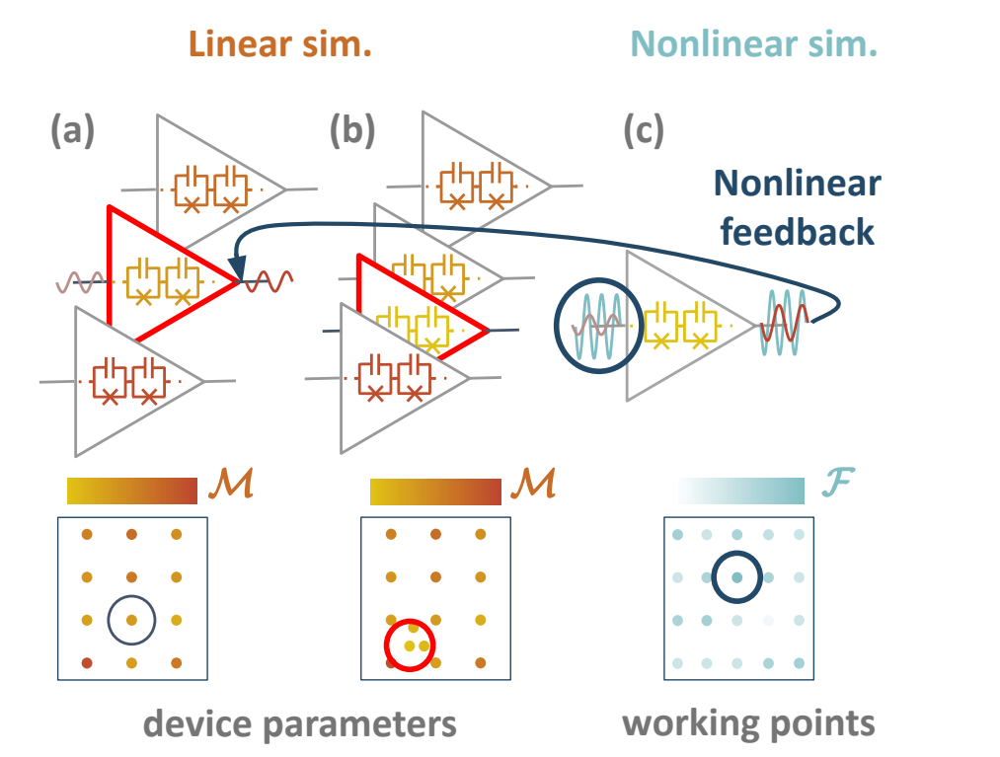
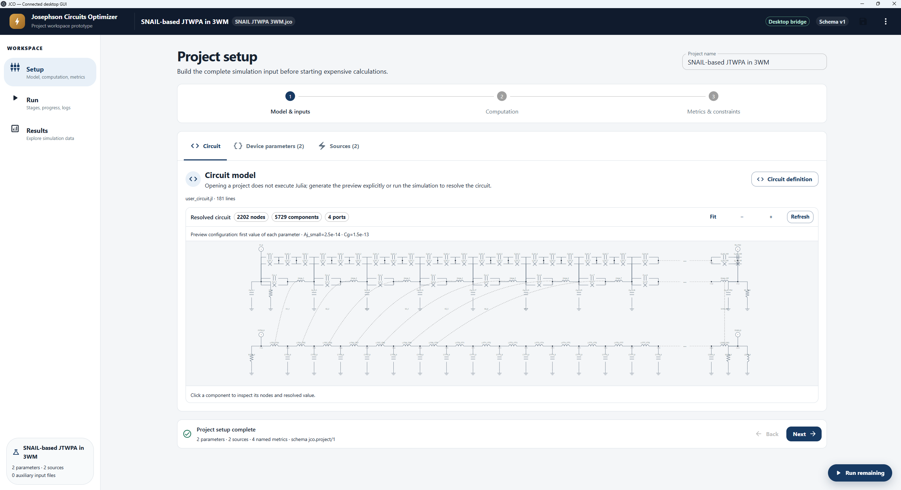
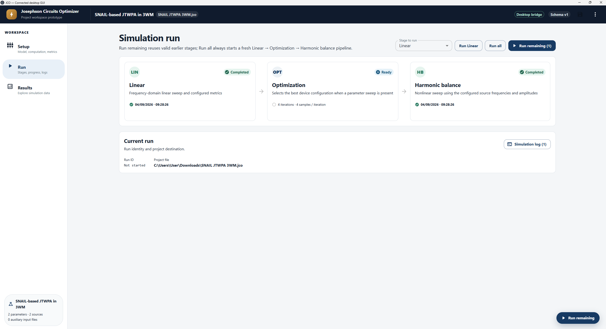
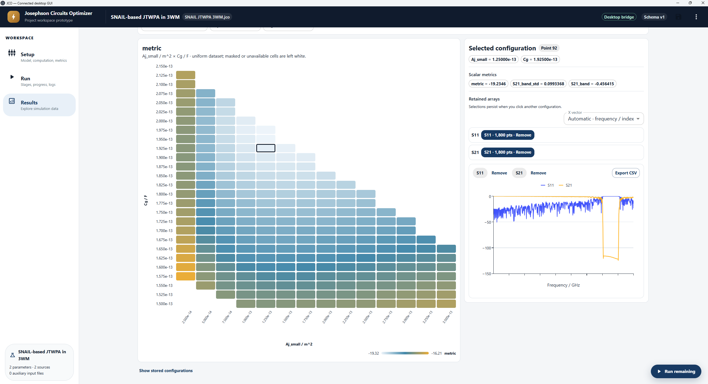

# JosephsonCircuitsOptimizer.jl (JCO)

**JosephsonCircuitsOptimizer.jl (JCO)** is a Julia framework for the automated exploration and optimization of superconducting Josephson circuits. It is built on [JosephsonCircuits.jl](https://josephsoncircuits.org/), which performs the circuit simulations, while JCO organizes them into a structured workflow for parameter exploration, optimization, and nonlinear analysis.

JCO combines three levels of analysis:

1. a computationally efficient **linear design-space exploration**;
2. a **surrogate-based optimization** that refines the most promising device parameters;
3. a **nonlinear harmonic-balance analysis** of the selected design over its physical working points.

<p align="center">
  
</p>

<p align="center"><em>JCO workflow: linear exploration and optimization of device parameters followed by nonlinear working-point analysis.</em></p>

The project includes a desktop GUI and stores complete experiments in portable `.jco` project files.

> **Version 0.3.0** introduces the integrated desktop architecture, `.jco` project workflow, stage-aware execution and reuse, structured Results views, retained-array persistence, and preliminary Linux launcher support.

## Desktop GUI

The desktop application follows the same scientific workflow through three main areas.

### Setup

<p align="center">
  
</p>

<p align="center"><em>Define the circuit, device parameters, sources, and computation settings, and inspect the resolved lumped-element circuit preview.</em></p>

### Run

<p align="center">
  
</p>

<p align="center"><em>Execute the Linear, Optimization, and Harmonic Balance stages, with stage status, reuse, cancellation, and simulation logs managed from one view.</em></p>

### Results

<p align="center">
  
</p>

<p align="center"><em>Explore the sampled design space, selected configurations, scalar metrics, and retained frequency-resolved data.</em></p>

## Documentation

The complete user documentation is available here:

**[JCO User Manual (PDF)](docs/JCO_Documentation.pdf)**

The manual covers project structure, GUI usage, experiment syntax, circuit and source definition, solver and optimizer settings, `user_cost`, `user_performance`, masks, nonlinear feedback, parametric sources, and retained data.

Developer and contributor documentation is kept separately in `AGENTS.md`, `adr/`, `audits/`, `docs/`, and `governance/`.

## Quick start

### Requirements

- **Julia** is required for circuit previews and simulations.
- Node.js/npm do **not** need to be installed globally when using the desktop launchers; the GUI runtime is prepared locally on first launch.
- An internet connection may be required on first use to prepare the GUI runtime and instantiate Julia dependencies.

### Windows

From the repository root, double-click:

```text
START_JCO_GUI.bat
```

or run:

```powershell
.\START_JCO_GUI.bat
```

Use **Settings** in the GUI to select the Julia executable and the desired number of Julia threads.

### Linux

From the repository root:

```bash
chmod +x START_JCO_GUI.sh
./START_JCO_GUI.sh
```

> **Linux support is preliminary.** The launcher supports x86-64 and ARM64/aarch64, but Linux has been less extensively validated than Windows and may require distribution-specific Electron/system libraries.

## Running directly from Julia

JCO can also be run without the desktop GUI:

```julia
using Pkg
Pkg.activate(".")

import JosephsonCircuitsOptimizer as JCO
JCO.run()
```

Optionally specify another workspace with:

```julia
JCO.run(workspace=raw"C:\...\my_experiment_01")
```

## The `.jco` project

A `.jco` file is a versioned ZIP container that keeps the editable experiment definition together with retained simulation runs and numerical results.

It can include:

- circuit and device-parameter definitions;
- source configuration;
- simulation and optimizer settings;
- user-defined cost, performance, helper, and parametric-source code;
- optional calibration/text files;
- stored outputs from multiple runs.

The project can therefore be moved or archived as a single file while remaining transparent and compatible with the underlying Julia/JSON/HDF5 representation.

See the [User Manual](docs/JCO_Documentation.pdf) for the full project format and experiment syntax.

## Scientific workflow

The Linear stage explores the device-parameter space through a user-defined cost function. The Optimization stage refines the most promising region, and the selected device is then evaluated in the nonlinear regime through a user-defined performance function.

Optional nonlinear feedback can use information from the nonlinear solution in a subsequent optimization cycle.

The circuit simulations are performed by [JosephsonCircuits.jl](https://josephsoncircuits.org/).

## Tests

GUI tests and build:

```bash
cd gui
npm test
npm run build
```

## Citation

If you use JCO in scientific work, please cite:

> E. Palumbo *et al.*, **“JCO: Optimization Framework for Nonlinear Superconducting Circuits Using a Lumped-Element Approach and Harmonic Balance”**, *IEEE Transactions on Applied Superconductivity* (2026).  
> DOI: [10.1109/TASC.2026.3679488](https://doi.org/10.1109/TASC.2026.3679488)

Repository:

https://github.com/SQE-INRiM/JosephsonCircuitsOptimizer

## License

JosephsonCircuitsOptimizer.jl is released under the [MIT License](LICENSE.md).
