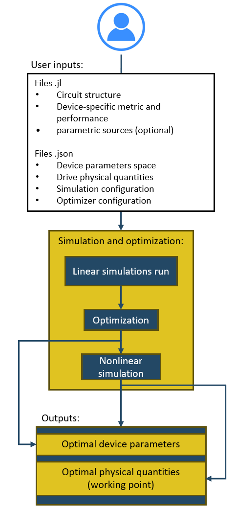

# JosephsonCircuitsOptimizer.jl

[JosephsonCircuitsOptimizer.jl](https://github.com/SQE-INRiM/JosephsonCircuitsOptimizer) is a Julia package that provides a simulation and optimization framework developed using the [JosephsonCircuits.jl](https://github.com/kpobrien/JosephsonCircuits.jl) library [1].  
JosephsonCircuits.jl enables the modeling of superconducting circuits, including Josephson junctions and other nonlinear elements, within a lumped-element approach.  
JCO leverages harmonic balance [2], a frequency-domain technique that offers a computationally efficient alternative to traditional time-domain simulations [3].

Thanks to this approach, the response of a single circuit can be evaluated efficiently, enabling the exploration of a large design space defined by multiple device parameters.  
The **Josephson Circuits Optimizer (JCO)** automates the search for optimal circuit designs by combining physically relevant metrics with Bayesian optimization based on Gaussian processes [4], ultimately identifying both the optimal circuit configuration and its optimal operating point.

---

## Installation

Clone the repository from GitHub:

```bash
git clone https://github.com/SQE-INRiM/JosephsonCircuitsOptimizer.git
```

The package requires a **working space**, which contains all user inputs and generated results.  
A default `working_space/` directory is provided inside the repository, but an external folder can also be selected via the GUI or specified when calling `run()` from Julia.

You can run JCO through the **GUI**:

- **Windows**: double-click `launch_gui.bat`
- **macOS / Linux**: double-click or run `launch_gui.sh`

Once the GUI is open, select the working space folder for the experiment and start the process using **Start Simulation**, **Sweep Only**, or **Opt + Nonlin from Latest**.  
*Note: the first run may take longer due to environment initialization.*

### Running directly from Julia

Activate the local environment:

```julia
using Pkg
Pkg.activate(".")
```

Run the full workflow:

```julia
import JosephsonCircuitsOptimizer as JCO
JCO.run()
```

To use a custom working space:

```julia
JCO.run(workspace=raw"C:\...\my_experiment_01")
```

### Updating the package

To update to the latest version:

```bash
git pull
```

---

## Simulation and Optimization Process

The JCO workflow consists of three main stages:

1. **Linear Simulations**
   - Circuits are analyzed at low pump power.
   - A uniform sampling of the device-parameter space is simulated.
   - A device-specific metric is evaluated for each configuration.

2. **Bayesian Optimization**
   - Gaussian-process–based Bayesian optimization is applied.
   - The parameter space is iteratively refined to minimize the metric.
   - An optimal set of device parameters defining the circuit design is identified.

3. **Nonlinear Simulations**
   - The selected circuit is simulated at high pump power.
   - Physical quantities are tuned to maximize the targeted performance (e.g., gain profile).
   - The optimal operating point of the circuit is determined.

<p align="center">
  
</p>

---

## Working space structure

JCO operates within a **working space**, which contains all user-defined inputs, generated datasets, and simulation outputs.  
The working space can be the default `working_space/` directory or any **external folder** selected by the user.

The structure is designed to:
- keep inputs and outputs clearly separated,
- ensure full reproducibility of each run,
- allow restarting the workflow from intermediate stages.

### User inputs

All user-defined inputs are placed in:

```plaintext
working_space/user_inputs/
```

These files define the circuit, simulations, and optimization settings:

- `device_parameters_space.json`  
  Defines the device-parameter space used for circuit design.

- `drive_physical_quantities.json`  
  Defines frequency ranges and excitation tones (pump, signal, idler, etc.).

- `optimizer_config.json`  
  Configuration of the Bayesian optimization process.

- `simulation_config.json`  
  Configuration of linear and nonlinear simulations, including optional nonlinear correction.

- `user_circuit.jl`  
  Circuit definition using a lumped-element approach.

- `user_cost_and_performance.jl`  
  Definition of the device-specific metric and performance functions.

- `user_parametric_sources.jl` *(optional)*  
  Definition of sources whose parameters depend on device parameters.

### Outputs

Each run generates a timestamped output folder:

```plaintext
working_space/outputs/output_YYYY-MM-DD_hh-mm-ss/
```

This folder contains all information required to analyze and reproduce the run:

- `df_uniform_analysis.h5`  
  Dataset produced by the linear sweep.

- `inputs_snapshot/`  
  Snapshot of all input files used for the run.

- `optimal_device_parameters.json`  
  Optimal device parameters defining the circuit design.

- `optimal_physical_quantities.json`  
  Optimal physical working point.

- `run_config.json`  
  Machine-readable summary of inputs, settings, and results.

- `versions.txt`  
  Julia environment and package versions.

- `status.json`  
  Run status (`running`, `completed`, `stopped`, `error`).

- `STOPPED.txt` *(only if interrupted)*

A convenience pointer:

```plaintext
working_space/outputs/LATEST.txt
```

always stores the path to the most recent run.

### Visualization folders

```plaintext
working_space/plots/
working_space/correlation_matrix/
```

Plots and correlation matrices are stored separately for quick inspection.  
Each plot is accompanied by a metadata file describing the parameters, metric value, timestamp, and run identifier.

### Summary

```plaintext
working_space/
├── user_inputs/
│   ├── device_parameters_space.json
│   ├── drive_physical_quantities.json
│   ├── optimizer_config.json
│   ├── simulation_config.json
│   ├── user_circuit.jl
│   ├── user_cost_and_performance.jl
│   └── user_parametric_sources.jl (optional)
│
├── outputs/
│   ├── output_YYYY-MM-DD_hh-mm-ss/
│   │   ├── df_uniform_analysis.h5
│   │   ├── inputs_snapshot/
│   │   ├── optimal_device_parameters.json
│   │   ├── optimal_physical_quantities.json
│   │   ├── 
│   │   ├── run_config.json
│   │   ├── versions.txt
│   │   ├── status.json
│   │   └── STOPPED.txt (if stopped)
│   └── LATEST.txt
│
├── plots/
└── correlation_matrix/
```

---

## GUI

JCO provides a lightweight Tkinter-based GUI to manage experiments directly from a working space.  
The GUI allows launching different stages of the workflow, monitoring progress, and inspecting results.


### Control panel

- **Start Simulation**  
  Runs the full pipeline:  
  *linear sweep → Bayesian optimization → nonlinear simulations (with optional nonlinear correction).*

- **Sweep Only**  
  Runs linear simulations only.

- **Opt + Nonlin from Latest**  
  Reuses the latest linear dataset and runs optimization and nonlinear simulations.

- **Clear Matrices**  
  Deletes all files in `correlation_matrix/`.

- **Clear Plots**  
  Deletes all files in `plots/`.

- **Use default workspace**  
  Resets the workspace path.

- **Restore LATEST inputs**  
  Restores input files from the most recent run snapshot.

- **Browse / Open Folder**  
  Selects or opens the working space directory.

### Status bar

Displays the current stage, progress bar, and estimated remaining time.

### Simulation output panel

- Live Julia logs
- Log levels: INFO, WARN, ERROR, PROGRESS
- Filtering and auto-scroll options

### Experiment files panel

- File browser for the working space
- Quick access to outputs and plots
- Shortcut to open the latest output folder

### Correlation viewer

- Correlation matrices and 1D parameter distributions
- Optimal parameter values highlighted
- Metadata display

### Plot viewer

- Linear and nonlinear simulation plots
- Navigation controls
- Metadata panel with metric values and parameters

---

## Examples

- **SNAIL-JTWPA use case**: see `examples/SNAIL-JTWPA.md`.

---

## Release notes (v0.2.0)

This release focuses on reproducibility, usability, and workflow modularity.

**Key improvements**
- Run bookkeeping (`run_config.json`, `versions.txt`, `LATEST.txt`).
- Plot metadata and traceability.
- GUI progress parsing, log filtering, and auto-scroll.
- Graceful cancellation via `WORKSPACE/STOP`.
- Additional run modes: sweep-only and dataset-only optimization.
- Enhanced visualization of correlations and optimal parameters.
- Improved optimization options
- Extended simulator support for multiple pumps.

---

## License

This project is licensed under the [MIT License](LICENSE.md).

---

## References

E. Palumbo *et al.*, “Simulation Framework for the Automated Search of Optimal Parameters Using Physically Relevant Metrics in Nonlinear Superconducting Quantum Circuits,” arXiv:2510.26479 [quant-ph].

1. K. P. O’Brien and contributors, *JosephsonCircuits.jl*, GitHub, 2024.
2. S. A. Maas, *Nonlinear Microwave and RF Circuits*, 2nd ed., Artech House, 1997.
3. A. Yu. Levochkina *et al.*, IEEE Trans. Appl. Supercond., 34(3), 2024.
4. R. Garnett, *Bayesian Optimization*, Cambridge Univ. Press, 2023.
5. N. E. Frattini et al., "Three-wave mixing Josephson dipole element," Appl. Phys. Lett., vol. 110, no. 22, p. 222603, May 2017, doi: 10.1063/1.4984142.
6. A. B. Zorin, "Josephson traveling-wave parametric amplifier with three-wave mixing," Phys. Rev. Applied, vol. 6, p. 034006, Sep. 2016, doi: 10.1103/PhysRevApplied.6.034006.