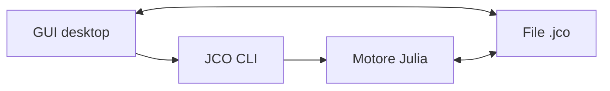

# JCO GUI — brief di progetto

## Obiettivo

Creare una GUI desktop per Josephson Circuits Optimizer (JCO) che permetta di:

1. creare o modificare un progetto di simulazione;
2. eseguire separatamente o in sequenza gli stadi Linear, Optimization e Harmonic Balance;
3. vedere stato, avanzamento, errori e risultati di ogni stadio;
4. esplorare i dati in modo interattivo senza salvare automaticamente immagini;
5. esportare solo i dati selezionati e filtrati.

La GUI non deve contenere la logica fisica o numerica. Deve comunicare con il motore Julia tramite un'interfaccia stabile.

## Decisione principale: un unico file `.jco`

Il formato consigliato è un file HDF5 con estensione applicativa `.jco`.

- Per l'utente è un singolo file: `nome_progetto.jco`.
- Python può leggerlo con `h5py`; Julia con `HDF5.jl`.
- Può contenere configurazioni, codice Julia come testo, risultati numerici e più run.
- I risultati possono essere aggiunti progressivamente durante una simulazione.
- Non contiene PNG, PDF o altri grafici generati automaticamente.

Il contenuto minimo è:

```text
/meta
    schema_version
    project_id
    created_at
    modified_at

/project
    config_json
    /code
        circuit.jl
        metrics.jl
        parametric_sources.jl       # opzionale
        helpers.jl                  # opzionale/avanzato

/runs/<run_id>
    run_metadata_json
    /linear
        stage_metadata_json
        parameters
        scalar_metrics
        traces                      # opzionali, per dati in funzione della frequenza
    /optimization
        stage_metadata_json
        evaluations
        optimum
    /hb
        stage_metadata_json
        sweep_coordinates
        scalar_metrics
        traces                      # opzionali, per gain/S-parameters vs frequenza
    /feedback                       # riservato per sviluppi futuri
```

Le configurazioni strutturate sono salvate come JSON; i dati numerici come dataset HDF5. Ogni dataset deve avere nomi di colonne/dimensioni, unità e descrizione.

Ogni run deve essere immutabile dopo il completamento. Una nuova esecuzione crea un nuovo `run_id` invece di sovrascrivere i risultati precedenti.

## Architettura



### Contratto GUI–Julia

Il motore deve essere avviabile con un comando stabile, per esempio:

```text
jco run progetto.jco --stages linear,optimization,hb
```

Lo standard output deve produrre eventi JSON Lines, non messaggi testuali da interpretare manualmente:

```json
{"type":"stage","stage":"linear","status":"running"}
{"type":"progress","stage":"linear","completed":25,"total":100,"eta_s":180.0}
{"type":"log","level":"info","message":"Circuit created"}
{"type":"stage","stage":"linear","status":"completed"}
```

Il processo deve restituire codici di uscita distinti per successo, annullamento, errore di configurazione ed errore di simulazione.

## Struttura della GUI

La navigazione principale ha tre sezioni:

1. **Setup**
2. **Run**
3. **Results**

La sezione **Feedback** verrà aggiunta successivamente.

Il menu File contiene:

- New
- Open
- Save
- Save As
- Export Data
- Quit

Non serve un comando separato “Modify”: aprire Setup significa modificare il progetto. Il titolo della finestra mostra `*` quando ci sono modifiche non salvate.

## Setup: wizard in tre passaggi

### 1. Model & Inputs

Tre pannelli nella stessa schermata:

**Circuit**

- editor del file `user_circuit.jl` con sintassi evidenziata;
- scelta di un template;
- pulsante Validate;
- visualizzazione chiara degli errori con riga e messaggio.

**Device parameters**

Tabella con colonne:

| Name | Mode | Value / Start | Stop | Step / Values | Unit | Tag |
| --- | --- | ---: | ---: | --- | --- | --- |
| `I0` | Range | `1e-6` | `5e-6` | `0.5e-6` | A | design |
| `Cg` | List |  |  | `[100e-15, 200e-15]` | F | design |

Mode può essere `Fixed`, `Range` o `List`. La GUI mostra anche il numero totale di configurazioni risultante dal prodotto cartesiano.

**Sources / Drives**

Tabella con una riga per sorgente:

| Source | Port | Frequency | Linear amplitude | HB amplitude | Mode |
| --- | ---: | --- | --- | --- | --- |

Ogni valore può essere `Fixed`, `Sweep` o `Function`. Le funzioni parametriche sono una funzione avanzata e vengono modificate in un editor Julia dedicato, non in una schermata separata.

### 2. Computation

Una schermata con tre tab:

- **Linear**: frequency grid, harmonics, mixing options, solver limits;
- **Optimization**: objective, surrogate, strategy, sampling, iterations, random seed;
- **Harmonic Balance**: harmonics, amplitude/frequency sweeps, convergence options.

La GUI calcola e mostra prima del run:

- numero di punti lineari;
- numero massimo di valutazioni dell'ottimizzatore;
- numero di punti HB;
- avviso quando la dimensione prevista dei dati è elevata.

### 3. Metrics & Constraints

Le metriche devono avere un'identità esplicita:

| Name | Stage | Role | Direction | Unit | Output kind |
| --- | --- | --- | --- | --- | --- |
| `reflection_mean` | Linear | Objective | Minimize | dB | Scalar |
| `third_harmonic` | Linear | Constraint |  | dB | Scalar |
| `gain_mean` | HB | Performance | Maximize | dB | Scalar + trace |

Ruoli possibili:

- Objective: unica metrica usata dall'ottimizzatore;
- Diagnostic: salvata e visualizzata ma non ottimizzata;
- Constraint/Mask: definisce se il punto è valido;
- Performance: usata per scegliere il working point HB.

La scelta dell'obiettivo non deve dipendere dalla posizione di una colonna o dal primo campo restituito da una funzione.

`user_metric_utils.jl` non deve essere una sezione principale. Se ancora necessario, diventa **Advanced → Helpers**; idealmente le utility comuni vengono spostate nel package JCO.

## Run

La schermata contiene:

- pipeline visiva: `Linear → Optimization → Harmonic Balance`;
- un riquadro per ogni stadio con stato, numero di punti, durata e timestamp;
- pulsante principale **Run remaining stages**;
- possibilità avanzata di eseguire un singolo stadio;
- pulsante Stop;
- progress bar dello stadio attivo con `completed / total` ed ETA;
- log espandibile e filtrabile.

Stati ammessi:

- `Not ready`
- `Ready`
- `Running`
- `Completed`
- `Stale`
- `Failed`
- `Cancelled`

`Stale` è essenziale: significa che lo stadio era stato completato, ma un input da cui dipende è stato modificato.

Dipendenze:

| Modifica | Stadi invalidati |
| --- | --- |
| Circuito, parametri o sorgenti | Linear, Optimization, HB |
| Configurazione/metriche Linear | Linear, Optimization, HB |
| Configurazione Optimization o objective | Optimization, HB |
| Configurazione/metriche HB | HB |

Ogni stadio salva un hash dei propri input. La GUI usa gli hash per riconoscere automaticamente risultati validi e risultati stale.

## Results

In alto si selezionano il run e lo stadio. La pagina è divisa in:

- area grafico centrale;
- pannello destro con X, Y, Color/Metric e filtri;
- tabella dati opzionale in basso.

### Linear

- selezione della metrica lineare;
- X e Y scelti fra parametri e frequenza;
- heatmap quando esistono due assi variabili;
- line plot quando esiste un solo asse variabile;
- filtri/slice per tutti gli altri parametri;
- scelta dell'aggregazione (`mean`, `min`, `max`, `median`) quando una dimensione viene collassata.

Per usare la frequenza come asse, il motore deve salvare dati frequency-resolved. Le sole metriche aggregate attuali non sono sufficienti.

### Optimization

Prima versione:

- best objective vs evaluation;
- objective e metriche vs ciascun parametro;
- correlation matrix selezionabile Pearson/Spearman che includa anche objective e metriche;
- tabella delle valutazioni con optimum evidenziato.

Una matrice dei soli parametri su un campionamento cartesiano uniforme è poco informativa e non deve essere il grafico principale.

### Harmonic Balance

- metriche non lineari in funzione di frequenze e potenze/ampiezze delle sorgenti;
- heatmap con X, Y e metrica selezionabili;
- slicer per le altre sorgenti o dimensioni;
- curve frequency-resolved per gain o S-parameters quando salvate;
- visualizzazione distinta di punti converged, failed e skipped.

### Feedback

Non implementare nel primo MVP. Riservare però lo spazio nel file `.jco` e nella navigazione. In futuro dovrà confrontare cicli Linear/HB, correzioni e spostamento dell'ottimo.

## Salvataggio dei dati frequency-resolved

Per evitare file enormi, il progetto offre tre livelli:

1. **Scalar metrics only** — file piccolo, nessun grafico vs frequenza;
2. **Metrics + selected traces** — scelta consigliata per la GUI;
3. **Full solver data** — avanzato, con stima preventiva dello spazio richiesto.

I dati complessi devono essere salvati in modo interoperabile, preferibilmente come dataset `real` e `imag` con gli stessi assi.

## Export Data

Il dialog di export permette di scegliere:

- run e stadio;
- metriche/colonne;
- intervalli e filtri;
- solo selezione corrente oppure dataset completo;
- formato CSV per tabelle o HDF5 per dati multidimensionali/complessi.

Non vengono esportate immagini automaticamente.

## Backlog minimo per lo sviluppatore GUI

### Milestone 0 — contratto tecnico

- leggere e scrivere un file `.jco` vuoto;
- validare `schema_version`;
- definire con il lato Julia il comando CLI e gli eventi JSONL;
- aprire un progetto senza eseguire il codice Julia contenuto.

### Milestone 1 — Project editor

- New/Open/Save/Save As;
- wizard Setup in tre passaggi;
- tabelle Parameters e Sources;
- editor Julia per Circuit/Metrics/Advanced;
- validazione e indicatore modifiche non salvate.

### Milestone 2 — Runner

- avvio del processo Julia;
- progress e log da JSONL;
- Stop e gestione dei codici di uscita;
- stage cards e stati `Ready/Completed/Stale/Failed`;
- selezione e cronologia dei run.

### Milestone 3 — Data viewer

- selettore run/stage/metric;
- heatmap e line plot generici;
- filtri e slicer;
- viste specifiche Linear, Optimization e HB;
- export filtrato CSV/HDF5.

### Fuori dal primo MVP

- editor grafico del circuito;
- feedback non lineare;
- confronto avanzato fra run;
- modifica live di un run in corso;
- supporto a più simulazioni contemporanee;
- salvataggio automatico di figure.

## Criteri di accettazione del primo MVP

1. Un progetto può essere creato, salvato, chiuso e riaperto senza perdita di informazioni.
2. Il file `.jco` è portabile: non contiene path assoluti necessari al funzionamento.
3. La GUI non considera completato un processo Julia con exit code diverso da zero.
4. Modificare un input marca automaticamente come stale gli stadi dipendenti.
5. Un run interrotto resta visibile come `Cancelled` o `Failed`, senza corrompere i run completati.
6. I grafici vengono rigenerati dai dati; nessun PNG viene creato dal motore.
7. È possibile esportare una selezione filtrata in CSV o HDF5.
8. Gli esempi forniti con JCO superano una validazione automatica prima del run.

## Attività necessarie sul motore JCO prima dell'integrazione

### Bloccanti

1. Stabilizzare le firme di `user_cost`, `user_performance` e `user_nonlinear_correction`; gli esempi presenti nello snapshot non corrispondono alle chiamate del motore.
2. Rendere espliciti parametri, objective, altre metriche e constraint: l'ottimizzatore non deve assumere che l'ultima colonna sia la metrica.
3. Introdurre un `RunContext` al posto delle variabili globali condivise.
4. Creare una API pipeline unica con stadi richiesti, invece di duplicare la logica in più funzioni `run_*`.
5. Aggiungere test reali: attualmente il test suite contiene solo `@test true`.

### Bug concreti rilevati nello snapshot

- Nel ciclo di nonlinear feedback viene usato `best_idx` al posto di `cycle_best_idx`; vengono poi salvate le ampiezze del ciclo precedente.
- In presenza di metriche multiple, le colonne aggiuntive vengono scambiate per parametri dall'ottimizzatore.
- Un punto HB non convergente può essere comunque passato a `performance` quando lo skip è disabilitato.
- `update_physical_quantities` modifica in-place lo stato globale e non salva la frequenza scelta come ottima.
- Il nome HDF5 `df_nonlinear_conveging_results_matrix` contiene un refuso ed è diverso da quello documentato.
- La generazione dei punti usa un `Set`, quindi l'ordine del sweep non è deterministico.
- La simulazione lineare HB viene ripetuta per ogni ampiezza, anche se a frequenza e circuito fissati può essere calcolata una volta sola.
- Lo stato progressivo non conserva l'elenco degli stadi completati e l'ETA può riutilizzare stato vecchio.
- Gli esempi e il default workspace usano hook con nomi e argomenti diversi dal motore corrente.

### Miglioramenti prioritari

- Separare completamente plotting e simulazione; rimuovere dal core la generazione di PNG.
- Salvare status e motivazione anche per punti HB failed/skipped, non eliminarli dal dataset.
- Normalizzare i parametri dell'ottimizzazione in `[0,1]` e salvare il random seed.
- Sostituire il valore sentinella `metric < 9e7` con constraint/validità espliciti.
- Validare schema, unità, sweep vuoti, nomi duplicati e firme degli hook prima di avviare una simulazione costosa.
- Evitare `eval` e `include` durante la sola apertura del progetto; il codice viene eseguito soltanto dopo conferma di Run.
- Usare UUID per run e identificatori, non timestamp con risoluzione al secondo.

## Indicazione tecnologica

Se la GUI resta in Python, PySide6/Qt è una base più adatta di Tkinter per wizard, tabelle, docking, editor e grafici interattivi. La scelta finale può comunque seguire lo stack già conosciuto dallo sviluppatore.

La GUI Tkinter attuale può essere usata come riferimento per lancio, log e progress, ma non conviene estenderla: è un file monolitico di circa 1.450 righe con molto stato globale e logica di processo mescolata alla vista.
